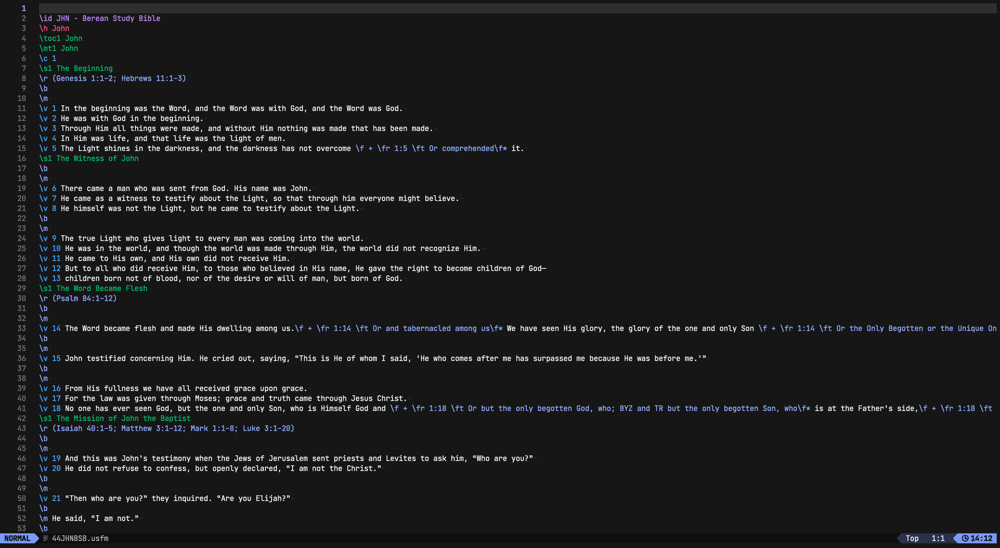

# usfm.vim

Vim syntax file for [USFM](https://ubsicap.github.io/usfm/) files.

## Screenshot



## Installation

### [vim-plug](https://github.com/junegunn/vim-plug)

```vim
Plug "letschurch/usfm.vim"
```

### [lazy.nvim](https://github.com/folke/lazy.nvim)

```lua
{
  "letschurch/usfm.vim"
}
```

### [packer.nvim](https://github.com/wbthomason/packer.nvim)

```lua
use 'letschurch/usfm.vim'
```
